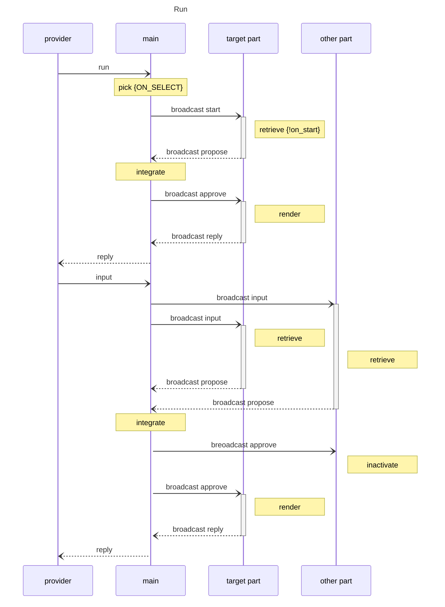

FiaryBiome-0.11 メインの動作機序
==========================================

mainはチャットボットの動作全体を統括する。

## 初期状態
チャットボットは初めて生成されたとき、名前が決まっていなければ{BOT_NAME_GENERATOR}を使って名前を新たに生成する。

## deploy
データのロード、必要な初期化を行う。
セッションタグを削除。
チャットボットは起動時に{ON_START}で決められたパートをactivateした状態で動作を始める。
0: firestore, graphql, indexedDBに存在するデータをsyncし、最新版がindexedDBに
    存在する状態にする。
↓
1 main: 

## run

