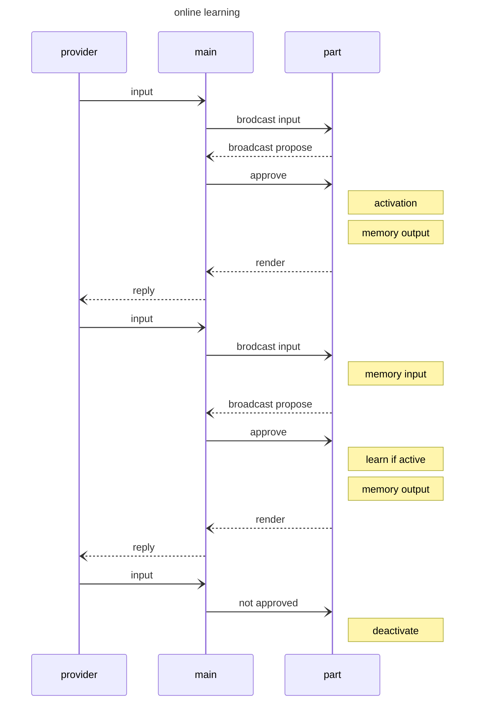

FairyBiome-0.11 パートの動作機序
=======================================

## パートの動作に影響を及ぼすパラメータ

以下のパラメータはmain.jsonのscriptでも定義され、各パートの動作時には各パートで定義した値が優先される。

### ACTIVATION
{ACTIVATION} 0.2,1.2,1.0,0.2,0.2
パートには活性状態、不活性状態がある。これをpart内の変数{ACTIVATION_LEVEL}で管理する。
パートは初期に不活性状態で{ACTIVATION_LEVEL}は0である。
この状態でパートが動作するたびに現在の{ACTIVATION_LEVEL}が0であれば{ACTIVATION}のうちランダムに一つが選ばれ、パートの出力はtfidfのスコアと{ACTIVATINO_LEVEL}の積になる。そのため{ACTIVATION_LEVEL}値が1より大きい場合は他のパートよりも優先して発火する確率が高くなる。これにより動作する/しないの挙動にランダム性が導入される。出力文字列の中に{DEACTIVATE}が明示されたら{ACTIVATION_LEVEL}は0になる。
このパートを排他的に動作させたければ10など他とくらべてより大きな値を設定する。

### FORCED_ACTIVATION
{FORCED_ACTIVATION} 10,8
外部からこのパートをactivateする場合、{ACTIVATION_LEVEL}は{FORCED_ACTIVATION}から選ばれる。

### RETENTION
{RETENTION} 0.8
一旦活性化状態に移行したパートは{ACTIVATION_LEVEL}値が記憶され、以降も活性な状態がある期間持続する。その期間を決めるため、活性化状態の間はパートが動作するたびに{ACTIVATION_LEVEL}は{ACTIVATION_LEVEL}と{RETENTION}の積を取り、それを次の{ACTIVATION_LEVEL}値とする。{ACTIVATION_LEVEL}が0.1を下回ったら不活性状態に移行する

## テキストのエンコード
入出力文字列は内部的にNode列に変換して扱う。各Nodeはsurface(表層形)とtokenからなり、以下のように表す。
```
surface   私は     昨日  お兄さんと     山に      登った    よ     。 
         -------- ------ ------------- ---------- -------- ------ ----
token     {I}\tは  0233   0003\tと      3434\tに   4433     \tよ   \t。
```
トークンは「私は」「俺は」など言い回しが違うが意味が同じになるものを統合して扱う単位である。トークンの中で同じ意味とみなす語句はICI(交換可能概念識別子,Interchangeable Concept Identifer)とよび、そのIDをtokenに格納する。なお、「お兄さんは」の接頭語「お」、接尾語「さん」は表記ゆれとみなし同じICIとし、助詞「は」はtokenの中でICIの後ろにタブ区切りで格納する

この前処理によって少量のコーパスで様々な会話に対応することを目指す。

辞書をエンコードする場合は全辞書を走査した後vocabを生成するため未知語は生じないが、ユーザ入力には未知語が含まれることがある。tfidfではその場合演算できなくなる。そこでvocabにない語句はできるだけ連続した一つにまとめ、そのうちの一つに{UNKNOWN}というトークンを割り当て、それ以外は無視する。

### SLOTモード
チャットボットがユーザの入力を学習するとき、{SLOT_REQUEST}というコマンドを出力文字列に含めてくる。これを受け取ったら次のテキスト解析はSLOTモードになる。SLOTモードでは「それは」「ええと」などの前置きを{PREFILLER}、「です。」「だよ」など後に置かれるセリフを{POSTFILLER}というタグに変換し、残った部分を{SLOT}に代入して返す。

### YESNO モード
チャットボットがユーザの入力についてyes/noを判断したいとき、{YESNO_REQUEST}コマンドを出力文字列に含めてくる。これを受け取ったら次のテキスト解析はYESNOモードになる。YESNOモードではSLOTモードでは「それは」「ええと」などの前置きを{PREFILLER}、「です。」「だよ」など後に置かれるセリフを{POSTFILLER}というタグに変換し、残った部分を{YES}または{NO}に帰属して返す。


### 交換可能概念識別タグ(Interchangeable Concept Identification Tag, ICIタグ)

例えば「私はテニスが好きだ」に対して「あなたはテニスが好きなんですね」と返す。辞書としてこの入出力のペアを記憶しておくことが素朴な方法であるが、これを一般化すれば「私は{X}が好きだ」に対して「あなたは{X}が好きなんですね」であり、さらに「私は{X}が{Y}だ」に対して「あなたは{X}が{Y}なんですね」となると小さい辞書でもかなり柔軟性の高い応答が可能になる。
ここで{X}に入ってもよいのは
```
テニス,庭球
```
のような同義語にとどまらず、
```
テニス,庭球,ゴルフ,野球,山登り,料理,...
```
のように同じ文脈に現れうるものは幅広く許容される。そこで{X}や{Y}に当てはまる語句のグループを予め定義しておき、inScriptやoutScriptに対応する語句が現れた場合それを[0023]のように数字４桁以上からなるICIに置き換える。入力文字列に出現したICIの表層形は記憶しておき、出力文字列に同じICIが現れた場合、これを記憶した内容に置き換える。
ICIでは交換可能な概念をリストとして扱う。順番は概念が近い順であり、後述のオントロジーにより概念の近さを定義する。


## タグ
### 明示的タグ
入力文字列には{tag}のように変数名を{}で囲った表記を埋め込むことができる。これをタグと呼ぶ。テキスト解析ではタグはtokenにそのまま利用される。

```
surface   私は     {animal}を     見た     。 
         -------- ------------ --------- ----
token     {I}\tは {animal}\tを    0343     \t 。

```
ここで{animal}は別途
```
{animal} 犬,うさぎ,猫,たぬき
```
のように定義しておき、出力文字列を生成する際にはカンマ区切りで与えた候補の中からランダムに選んだ一つに再帰的に置き換えられる。タグは以下の3種に分けられ、表記方法で区別する

| 例         | 表記     |
|----------- |----------|--------------------------|
| {SYSTEM}   | 大文字   | システム用               |
| {Persist}  | 頭大文字 | ユーザ用の永続化記憶     |
| {session}  | 小文字   | ユーザ用の永続しない記憶 |
| {0000}     | 数字     | ICI(ユーザは使用禁止)    |

{SYSTEM}タグはシステムが利用する記憶で、
通常この記憶は上書きされず、消えることもない。またtoken上でも同じ
タグがあり、入力文字列がシステムタグであることを認識するのに利用
する。またシステムタグはチャットボットの語尾や人称を表現するのにも
もちいる。

出力文字列中に{greeting} のように記述されたタグは、定義された{greeting}の内容に再帰的に展開される。加えて展開後の内容が記憶されて以降{greeting}を展開する場合に記憶したものが使われる。つまりランダム選択が起きなくなる。{-greeting}のようにマイナス記号を先頭に付加すると記憶が破棄され、{-greeting}自体は展開結果が空文字列になる。{+greeting}とした場合は以前記憶したものを無視してランダム選択をやり直す。
{greeting}に展開するべき候補が定義されていない場合は展開結果が空文字になり、空文字であることが記憶される。

### 特殊なタグ

{SHAPE_SHIFT} このタグは「妖精によってユーザの姿が変えられてしまう」のためのもので、このタグがレンダリングされるとユーザのアバターが_で始まるディレクトリのアバターの中からランダムに選んだ一つに強制的に変更される。このタグ自体は空文字列に置き換rえらえる。


### 暗黙的タグ
人称代名詞のように特に重要なキーワードはICIと同様にtoken化する。
```
surface   私は   
         --------
token     {I}\tは

```
{I}などは入力用と出力用があり、エンコード時には入力用、デコード時には出力用を利用する。

### タグを使った条件判断

入力文字列でタグ名の前に?を入れることで、そのタグが存在しているかどうかを判断する動作になる。
```
{?greeting}
{?ALARM_MONDAY}
```
つまり{?greeting}は過去に{greeting}が記憶されていればテキストマッチングの際に{greeting}とみなされ、過去の記憶になければそのノードは破棄される。これにより、入力文字列に{?greeting}を記述しておくと「{greeting}が行われていればこの発言をする可能性が高くなる」という動作になる。
{?!greeting}{!greeting}のようにタグ名の前に?!または!を加えると、意味は否定になり、「{greeting}が行われていなければこの発言をする可能性が高くなる」という動作になる。ここで、否定の条件を

## ecosystemによるタグ

天候と場所の情報はユーザやチャットボットの発言の付属情報として扱う。晴れているときに適切な発言、雨のときに適切な発言などを考慮できる。そのため、ユーザ発言、チャットボット発言ともにログに記録されるときに
{?ECOSYS_SUNNY}{?ECOSYS_ROOM}
という情報を付加する。

## 未知の単語の学習
ユーザから入力された文字列の中にチャットボットにとって未知の単語がある場合、tfidf演算ができない。
そこで未知の語句が見つかった場合は連続した未知語句をひとまとめとし、一文から見つかった未知語句のうちランダムに選んだ一つに{UNKNOWN}というタグを付与する。
辞書中で

user {UNKNOWN}
bot {UNKNOWN}って何？

という項を設ければ未知の単語に出会った場合の挙動を記述できる。なお、パートが受け取ったやり取りはパートの辞書に自動で追加され、チャットボットを再起動したらそれが反映される。この動作によって今回未知であった単語は次回起動時に未知ではなくなる。

## 知識の学習
チャットボットはユーザの発言からニックネーム、好きな食べ物などの単語を学習する。
学習するべき単語は、例えば「ユーザのニックネームは〇〇」のようにtriple表現になり、将来的にはオントロジーと呼ばれる概念の体系的記述を利用するべきであるが、本バージョンではその簡易版としてユーザとチャットボット本人について下記のような属性を扱う。本来であれば、例えば好きな食べ物は複数あり、それらを区別して扱う必要があるが、いずれも区別なく混在したまま扱う。
以下で示した内容のうちNameのように頭文字大文字のroleは永続的、mental_conditionのようにすべて小文字のroleはsession中のみ持続する記憶である。

```json
USER: {
    is_a:"CAST"
}

BOT: {
    is_a:"CAST"
}

CAST: {
    slots: [
        {role:"Name", constraint: "__string__", surfaces: ["名前"]},
        {role:"Nickname", constraint: "__string__", surfaces: ["ニックネーム"]},
        {role:"Favorite_food", constraint: "FAVORITE_FOOD", surfaces:["好きな食べ物"]},
        {role:"Disliked_food", constraint: "DISLIKED_FOOD", surfaces:["嫌いな食べ物"]},
        {role:"body_condition", constraint: "__string__", surfaces:["体調"]},
        {role:"mental_condition", constraint: "__string__", surfaces:["気分"]},
    ]
},

FOOD: {
  slots: [
        {role:"Name", constraint: "__string__", surfaces: ["名前"]},
        {role:"Taste", constraint: "__string__", surfaces: ["味"]},
  ]
},
FAVORITE_FOOD: {
    is_a: "FOOD",
    slots: [
        {role:"Favor_reason", constraing:"__string__", surafces:["好きな理由"]}
    ]
},

```
オントロジーの各属性は辞書に対応し、
{#USER.Name} ユーザの名前
{USER.Name} かえで
{USER} かえで
{#USER.Favorite_food} かえでの好きな食べ物
{#USER.Favorite_food.Name} かえでの好きな食べ物の名前 
{USER.Favorite_food.Name} クロワッサン 
{USER.Favorite_food.Taste}
のように、`{USER.Name}`は「かえで」のようにユーザ名の実体、先頭に#をつけた`{#USER.Name}`は「あなたの名前」というラベル文字列になる。

また{USER}自体は以下のようにその属性のリストになり、展開された結果この中からランダムに選ばれた一つになる。
{USER} {USER.Name},{USER.Nickname},{USER.Favorite_food},{USER.Dislike_food} 

チャットボットは最初、USER.Name以外の実体の記憶が空の状態から始まり、空のスロットに値を埋めようとする。
チャットボットの質問に対するユーザの回答はチャットボットにとって未知の単語である可能性があり、その場合はtfidfによる演算が不可能である。
そのため、スロットを埋める質問のあとの回答はパターンマッチングにより処理する。bot発言に`{SLOT_REQUEST}`というコマンドを記述することで次のユーザ入力は{SLOT}に取り込まれるようになる。

bot {#+USER}について教えて{?!USER}{SLOT_REQUEST}
user {SLOT}だよ
bot {SLOT}でいい？{YESNO_REQUEST}
user {NO}
bot そっか。
bot {SLOT}でいい？{YESNO_REQUEST}
user {YES}
bot {=USER}だね。


{SLOT}モードでは「それは」「ええと」などの前置きと「だよ。」のように意味のない語尾を含まない残りすべてをSLOTに割当てる。
SLOTへの割当後、{=USER.Name}のようにすることで知識に加えられる。

## 会話内容の記憶
bot「こんにちは」
user「今日は暑かったね」
のようなやり取りはbotが記憶して自分の発言に再利用する。上述の例の場合は
挨拶を行うパートに記憶されるのが適切で、アクティブ状態になっている
パートがそれを記憶する。機序としてはactivation時点で出力を記憶する。
その次のユーザ入力も記憶しておき、partの発言が確定した(activationLevelが
0より大)ところで出力と入力の組み合わせを記憶する。



この記憶はscriptsデータベースを利用する。各記憶は「doc」という属性があり、
jsonの元データにあるoriginと、新たに獲得した0,1,...に分ける。
ページに分けるのは.jsonが更新されたときにorigin部分だけ書き換えられるように
する目的で、また獲得したデータがfirestoreのdocの最大サイズを超えた場合に
切替可能にするためである。が、最大サイズ対策は当面実装しない。

## 出力文字列のレンダリング

出力文字列はoutScriptにテキストとして格納されている。
だがこのテキストは入力文字列と組み合わせて一種のテンプレートとして
用い、例えば「動物園」という言葉は「水族館」でも置き換え可能にしたい。

user ねえ、今日は動物園に行ったんだよ
bot そうなんだ。動物園どうだった？
↓
user ねえ、今日水族館行ってきた！
bot 水族館は面白かった？

そのため入力文字列では置き換え可能な概念をwordTag化する。
入力文字列にあるwordTagが含まれ、回答として採用された場合に
出現したwordTagと元になった文字列の組み合わせをmemoryに記憶する。

次にoutScriptもnodes列に変換し、そこにwordTagが含まれていたら
文字列に戻す。


## テキストのデコード
node列をテキストに戻す際には以下の処理を行う。
返答内容が下記であった場合、
```
surface   私は     昨日  お兄さんと     山に      登った    よ     。 
         -------- ------ ------------- ---------- -------- ------ ----
token     {I}\tは  0233   0003\tと      3434\tに   4433     \tよ   \t。
```
これまでの会話で0003などが入力文字列に出現した場合はその時のsurfaceを記憶しておき、
もとのsurfaceの代わりに記憶したものを利用する。
{I}などのタグは出力用のタグから再帰的に展開して置き換える。

通常のタグ`{greeting}`やランダムピックアップを指定するタグ`{+greeting}`は再帰的に展開して置き換える。
タグ記憶の削除を指示するタグ`{-greeting}`は空文字列に置き換える。

## 辞書の書式

### system_token.json
{
    '{PREFILLER}':[],
    '{POSTFILLER}':[],
    '{I}:[],
    '{YOU}:[],

}

### config.jsonの書式
チャットボットの基本設定は以下の内容で、
項目名が大文字と_のみからなるものは、チャットボットの辞書から
タグを利用して参照できる

```
{
    id, # firestore上のIDが自動で付与される 
    avatarDir,
    backgroundColor,
    alarms: {
        [alarm名]: {
            year, month, date, day,
            hour, min
        }
    }
    RESPONSE_INTERVAL: [], # カンマ区切りで返答間隔(msec)を列挙。ランダムに選ばれる
    AWAKENING_HOUR: [], # チャットボットの起床時間
    BEDTIME_HOUR: [],  # チャットボットの就寝時間
    BOT_NAME,  チャットボットの名前
    UPDATED_AT: # "yyyy/mm/dd hh:mm:ss" という形式の文字列を保存時に自動で付与 
    I: [], # チャットボットが使う一人称
    YOU: [], # チャットボットがつかう二人称
}
```

### パートの書式

会話ログを以下のような形式で記述
```
{ACTIVATION}  ,optional
{FORCED_ACTIVATION} ,optional
{tag} タグの定義, optional
with {?tag} すべてのbot,user,ecosys行に追加される条件タグ, optional

user ユーザ発言\t{timestamp}\t
bot ボットの返答({AVATAR}が表示される)\t{timestamp}\t
peace ボットの返答(先頭が有効なavatar名の場合そのavatarが表示される)
```

## TODO
* -- timeMatrixがきちんと動作してるか確認 --
* wordタグへの置き換え、戻しが動作しているか
* firestoreへの書き戻しが動作しているか

## BUG
* firestore上でscriptsのpage0データがoriginに格納されてしまう
* -- db.scriptsでtext:""になっているデータがある。例えばid=48 --
* -- user発言はpageがあるがbotはない --
* -- DEFAULT_AVATARが効いていない --
* 新規な記憶がoriginに入ってる
* ブラウザを変えるとfsよりもgpが優先される
* -- authに失敗したときのメッセージがでない --
* fsにscriptのid情報を書き込みすぎ
* 新規な記憶のうち、以前と同じものをじも繰り返して記憶してしまう
